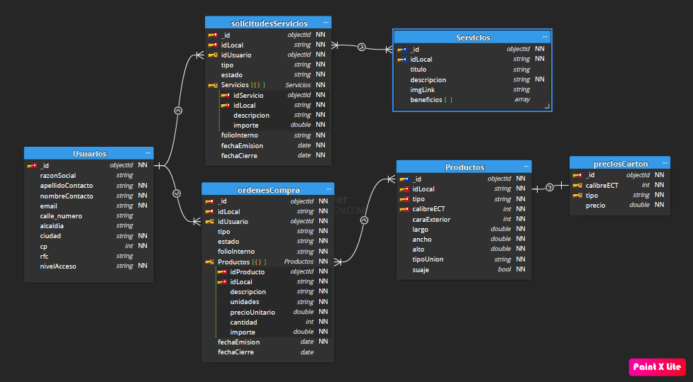

# Estructura de la Base de Datos (BD)

La base de datos fue construida con base al modelo NoSQL debido a las siguientes condiciones:
    
  1. Un usuario puede tener asignadas solicitudes sin un patrón obligatorio (tener asignada una o varias).
    
  2. Una solicitud o una orden de compra pueden tener asignados items sin un patrón obligatorio (tener uno, tener varios)
    
  3. Esta estructura puede utilizarse también para ligarse con Moongosee a una API para gestionar información desde la aplicación web de la empresa.
    
Como resultado se utilizó el siguiente diagrama desarrollado con la herramienta Moon Modeler para representar gráficamente las colecciones, los tipos de datos y las relaciones en el modelo de la BD.

Por cada colección existe un kernel para exportar registros directamente a la base de datos en MongoDB considerando en algunas colecciones órdenes repetitivas, objetos anidados y adición de registros específicos.

El kernel [**_raw_**](raw.ipynb) actualiza toda la información en un dataframe para el uso del resto de los códigos de análisis.
